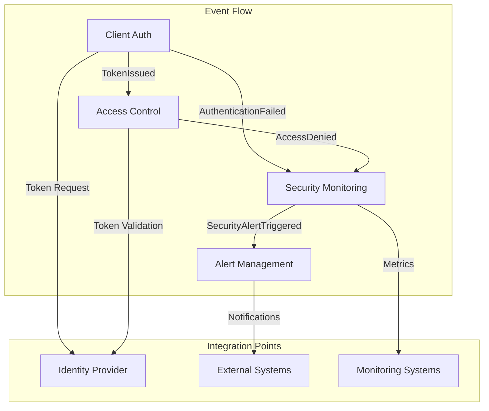
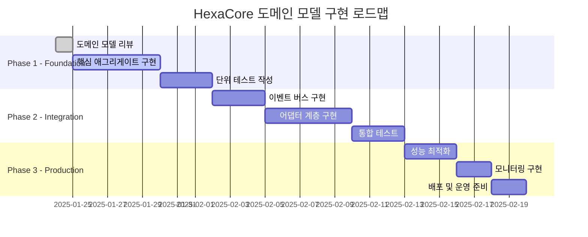

# HexaCore Security Domain Model

## Executive Summary

HexaCore는 API 클라이언트의 인증 및 접근 제어를 담당하는 보안 시스템입니다. 본 도메인 모델은 DDD(Domain-Driven Design) 방법론을 적용하여 설계되었으며, 5개의 바운디드 컨텍스트로 구성되어 있습니다.

### 핵심 비즈니스 가치

- 🔐 안전한 사용자 인증 (username/password → JWT)
- 🛡️ 다층 보안 정책 적용 (IP 제한, Rate Limiting)
- 📊 실시간 보안 모니터링 (OpenTelemetry, Prometheus)
- 🚨 지능형 위협 대응 (자동 계정 잠금, 위험도 평가)
- 📝 완전한 감사 추적 (모든 보안 이벤트 기록)

## 🏛️ 바운디드 컨텍스트 상세

### 1. Client Authentication Context

```yaml
name: Client Authentication Context
description: 사용자 인증 및 JWT 토큰 발급 관리 (Keycloak 통합)

aggregates:
  - Authentication:
      root_entity: Authentication
      entities: []
      value_objects:
        - Credentials (username/password)
        - Token (accessToken, refreshToken, expiresIn)
        - AuthenticationStatus (PENDING, SUCCESS, FAILED)
      invariants:
        - "Username과 Password는 필수"
        - "인증 성공 시에만 토큰 발급"
        - "실패한 인증은 토큰을 가질 수 없음"
      
  - AuthenticationSession:
      root_entity: AuthenticationSession
      entities:
        - AuthenticationAttempt
      value_objects:
        - SessionId
        - ClientIp
        - RiskLevel
      invariants:
        - "5회 실패 시 자동 잠금"
        - "잠금은 15분 후 자동 해제"
        - "IP별 실패 횟수 추적"

domain_events:
  - AuthenticationAttempted:
      triggers: "사용자가 로그인 시도"
      data: [id, username, clientIp, attemptTime, aggregateId]
      
  - AuthenticationSucceeded:
      triggers: "올바른 username/password로 인증 성공"
      data: [id, username, clientIp, tokenId, sessionId, authenticationMethod]
      
  - AuthenticationFailed:
      triggers: "잘못된 username/password 또는 인증 오류"
      data: [id, username, clientIp, reason, attemptCount, authenticationMethod, errorCode]
      
  - AccountLocked:
      triggers: "5회 연속 인증 실패"
      data: [id, username, clientIp, failedAttempts, lockReason, lockDuration, securityLevel]
      
  - Token Expired:
      triggers: "토큰 유효 기간 만료"
      data: [tokenId, username, clientIp, expirationTime]

domain_services:
  - AuthenticationDomainService:
      purpose: "인증 비즈니스 로직 처리"
      interface: "createAuthentication(credentials): Authentication"
      
  - JwtPolicy:
      purpose: "JWT 토큰 정책 관리"
      properties: 
        - secretKey: "${JWT_SECRET_KEY}"
        - expiration: 86400000 (24시간)
      
  - SessionPolicy:
      purpose: "세션 관리 정책"
      properties: 
        - maxFailedAttempts: 5
        - lockoutDuration: 15분
        - failureCountWindow: IP 기반

repositories:
  - SecurityEventRepository:
      purpose: "보안 이벤트 저장 및 조회"
      methods:
        - recordAuthenticationSuccess(authentication, clientInfo)
        - recordAuthenticationFailure(username, reason, clientInfo)
        - isClientLockedOut(clientInfo): boolean

external_integrations:
  - KeycloakClient:
      library: "com.sd.KeycloakClient"
      purpose: "Keycloak 인증 서버와 통합"
      operations:
        - basicAuth(username, password): KeycloakTokenInfo
        - getPublicKey(accessToken): RSAPublicKey
        - authenticationByOffline(accessToken, publicKey): VerifyTokenResult
      configuration:
        - baseUrl: "${keycloak.auth-server-url}/keycloak"
        - realm: "${keycloak.realm}"
        - clientId: "${keycloak.client}"
        - clientSecret: "${keycloak.client-secret}"
```

### 2. Access Control Context

```yaml
name: Access Control Context
description: IP 제한, Rate Limiting, 토큰 검증을 통한 API 접근 제어

aggregates:
  - AccessPolicy:
      root_entity: AccessPolicy
      entities:
        - IpRestriction
        - RateLimitRule
      value_objects:
        - PolicyId
        - IpRange
        - TimeWindow
        - ValidationResult
      invariants:
        - "정책은 버전 관리됨"
        - "모니터링 경로는 항상 허용"
        - "비활성 기능은 검증 생략"

  - RateLimitBucket:
      root_entity: RateLimitBucket
      entities: []
      value_objects:
        - BucketKey
        - ConsumptionResult
      invariants:
        - "토큰은 capacity 초과 불가"
        - "토큰은 음수 불가"
        - "Refill은 시간 비례"

domain_events:
  - AccessGranted:
      data: [clientId, clientIp, resource, timestamp]
      
  - AccessDenied:
      data: [clientId, clientIp, reason, timestamp]
      
  - RateLimitExceeded:
      data: [clientId, clientIp, bucketKey, retryAfter]

domain_services:
  - IpMatchingService:
      purpose: "CIDR 표기법 기반 IP 매칭"
      methods:
        - "matches(cidr, ip): boolean"
        - "isValidCidr(cidr): boolean"

repositories:
  - AccessPolicyRepository
  - RateLimitBucketRepository

caching_strategy:
  - "IP 검증 결과: 5분 캐싱"
  - "토큰 검증 결과: 1분 캐싱"
  - "Rate Limit 버킷: 메모리 캐시"
```

### 3. Security Monitoring Context

```yaml
name: Security Monitoring Context
description: 보안 이벤트 추적, 위험도 평가, 감사 로깅

aggregates:
  - SecurityEvent:
      root_entity: SecurityEvent
      entities:
        - RiskAssessment
        - RiskFactor
      value_objects:
        - EventId
        - SecurityEventType
        - ClientIdentifier
        - EventMetadata
      invariants:
        - "이벤트는 불변(immutable)"
        - "위험도 평가는 1회만"
        - "모든 이벤트 추적 가능"

domain_events:
  - RiskLevelEvaluated:
      data: [eventId, clientIdentifier, riskLevel, score]
      
  - SecurityAlertTriggered:
      data: [eventId, alertType, priority, recipients]

domain_services:
  - RiskEvaluationService:
      purpose: "이벤트 패턴 분석 및 위험도 계산"
      algorithm: "가중치 기반 스코어링"

repositories:
  - SecurityEventRepository
  - AuditLogRepository

metrics:
  - authentication_attempts_total
  - authentication_failures_total
  - account_locks_total
  - risk_level_distribution

external_integrations:
  - OpenTelemetry:
      sampling_rate: "10%"
      high_risk_sampling: "100%"
      exporters: ["Jaeger", "OTLP"]
  - Prometheus:
      scrape_interval: "15s"
      metrics_endpoint: "/actuator/prometheus"
```

### 4. Alert Management Context

```yaml
name: Alert Management Context
description: 보안 알림 발송, 재시도 정책, 알림 채널 관리

aggregates:
  - SecurityAlert:
      root_entity: SecurityAlert
      entities:
        - DeliveryAttempt
      value_objects:
        - AlertId
        - AlertType
        - AlertPriority
        - Recipient
        - AlertMessage
      invariants:
        - "P1 알림은 최대 3회 재시도"
        - "P2 알림은 최대 2회 재시도"
        - "재시도 간격은 지수적 증가"

domain_events:
  - AlertSent:
      data: [alertId, channelId, recipients, timestamp]
      
  - AlertFailed:
      data: [alertId, channelId, error, attemptCount]
      
  - AlertRetryScheduled:
      data: [alertId, retryAfterMs]
      
  - AlertEscalated:
      data: [alertId, reason, escalatedAt]

retry_policies:
  - P1_CRITICAL:
      max_attempts: 3
      backoff: "exponential"
      base_delay: "1000ms"
  - P2_HIGH:
      max_attempts: 2
      backoff: "exponential"
      base_delay: "500ms"

notification_channels:
  - Email:
      provider: "SMTP"
      templates: ["account_locked", "high_risk_detected"]
  - Slack:
      provider: "Slack API"
      webhooks: ["security-alerts", "ops-alerts"]
  - Webhook:
      provider: "HTTP POST"
      endpoints: ["SIEM", "PagerDuty"]

repositories:
  - SecurityAlertRepository
  - NotificationChannelRepository
```

### 5. Identity Provider Integration Context

```yaml
name: Identity Provider Integration Context
description: Keycloak과의 통합, 토큰 발급/검증 프록시

anti_corruption_layer:
  purpose: "Keycloak의 복잡한 프로토콜을 도메인 친화적 인터페이스로 변환"
  
  adaptations:
    - OAuth2TokenEndpoint:
        from: "POST /protocol/openid-connect/token"
        to: "TokenService.issueToken()"
        
    - TokenIntrospection:
        from: "POST /protocol/openid-connect/token/introspect"
        to: "TokenValidator.validate()"
        
    - JWKSEndpoint:
        from: "GET /protocol/openid-connect/certs"
        to: "KeyService.getPublicKeys()"

caching:
  - JWKS:
      ttl: "24 hours"
      refresh: "on-expiry"
  - TokenValidation:
      ttl: "60 seconds"
      key: "tokenId"

resilience_patterns:
  - CircuitBreaker:
      failure_threshold: 5
      timeout: "30s"
      half_open_requests: 3
  - Retry:
      max_attempts: 3
      backoff: "exponential"
  - Fallback:
      strategy: "cache"
      cache_duration: "5 minutes"
```

## 🔄 컨텍스트 간 통합 매핑



## 📊 주요 의사결정 기록 (ADR)

### ADR-001: 이벤트 기반 아키텍처 채택

```yaml
제목: 바운디드 컨텍스트 간 이벤트 기반 통신
상태: 승인됨
날짜: 2025-01-24

컨텍스트:
  - 각 컨텍스트는 독립적으로 배포 가능해야 함
  - 컨텍스트 간 강한 결합을 피해야 함
  - 감사 추적이 중요함

결정:
  - 도메인 이벤트를 통한 비동기 통신
  - 이벤트 스토어 도입 고려
  - 각 컨텍스트는 필요한 이벤트만 구독

결과:
  - (+) 느슨한 결합
  - (+) 완전한 감사 추적
  - (-) 최종 일관성 복잡도
  - (-) 이벤트 버전 관리 필요
```

### ADR-002: IP 기반 실패 횟수 추적

```yaml
제목: 인증 실패 카운팅 기준
상태: 승인됨
날짜: 2025-01-24

컨텍스트:
  - 무차별 대입 공격 방지 필요
  - 사용자 경험 vs 보안 균형

결정:
  - Client IP 기준으로 실패 횟수 추적
  - Client ID가 아닌 IP 기준 적용

이유:
  - 공격자는 여러 Client ID 시도 가능
  - 같은 IP에서의 반복 시도가 주요 위협

결과:
  - (+) 더 효과적인 공격 차단
  - (-) NAT 환경에서 정상 사용자 영향 가능
```

### ADR-003: 토큰 캐싱 전략

```yaml
제목: 토큰 검증 결과 캐싱
상태: 승인됨
날짜: 2025-01-24

컨텍스트:
  - 매 요청마다 Keycloak 호출은 성능 부담
  - 토큰 폐기 시 즉시 반영 필요

결정:
  - 1분간 토큰 검증 결과 캐싱
  - 캐시 키: tokenId
  - TTL: 60초

트레이드오프:
  - (+) 성능 향상 (Keycloak 부하 감소)
  - (-) 토큰 폐기 후 최대 1분 지연
  
완화책:
  - 중요 작업은 캐시 우회 옵션 제공
```

## 🔤 용어집 (Glossary)

```yaml
glossary:
  - term: "API Client"
    definition: "Basic Auth로 인증하여 토큰을 발급받는 외부 시스템"
    context: "Client Authentication"
    
  - term: "Access Token"
    definition: "Keycloak이 발급한 JWT 형식의 인증 토큰 (24시간 유효)"
    context: "전체"
    
  - term: "Client Credentials"
    definition: "client_id:client_secret 형식의 Basic Auth 자격증명"
    context: "Client Authentication"
    
  - term: "Rate Limit Bucket"
    definition: "토큰 버킷 알고리즘 기반 요청 제한 컨테이너"
    context: "Access Control"
    
  - term: "Risk Level"
    definition: "보안 이벤트의 위험도 (LOW/MEDIUM/HIGH)"
    context: "Security Monitoring"
    
  - term: "Circuit Breaker"
    definition: "외부 시스템 장애 시 빠른 실패를 위한 패턴"
    context: "Identity Provider Integration"
    
  - term: "CIDR"
    definition: "Classless Inter-Domain Routing, IP 범위 표기법"
    context: "Access Control"
    
  - term: "Token Introspection"
    definition: "토큰의 유효성과 메타데이터를 확인하는 OAuth2 엔드포인트"
    context: "Identity Provider Integration"
```

## 🚀 구현 로드맵



## 📋 체크리스트

- [x] 도메인 이벤트 정의
- [x] 애그리게이트 경계 설정
- [x] 불변성 규칙 문서화
- [x] 바운디드 컨텍스트 매핑
- [x] 통합 지점 명확화
- [x] 용어집 작성
- [x] ADR 작성
- [ ] 구현 시작

## 🎯 결론

HexaCore 보안 시스템의 도메인 모델이 DDD 방법론에 따라 성공적으로 설계되었습니다. 5개의 명확한 바운디드 컨텍스트로 분리되어 있으며, 각각은 독립적으로 개발 및 배포 가능합니다. 이벤트 기반 아키텍처를 통해 느슨한 결합을 유지하면서도 완전한 감사 추적을 제공합니다.

다음 단계는 이 도메인 모델을 기반으로 실제 구현을 시작하는 것입니다.